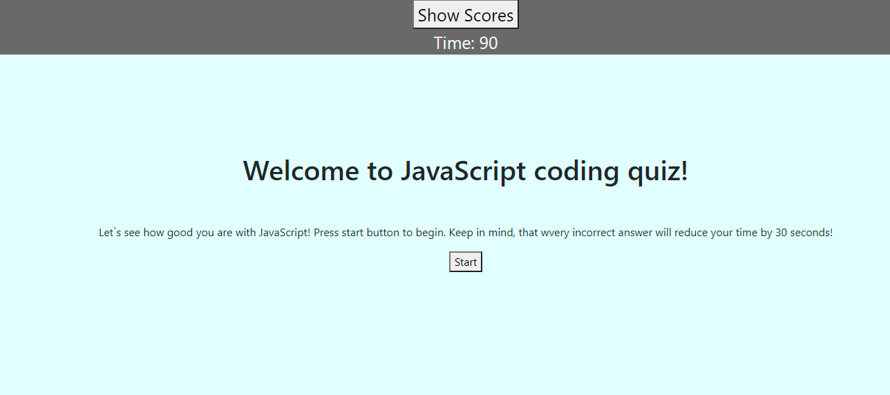
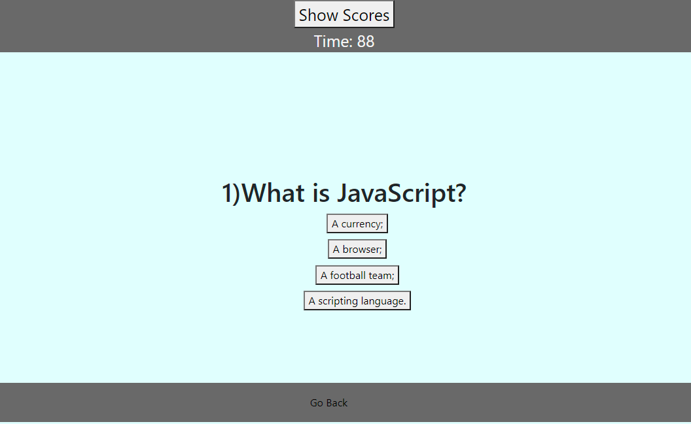
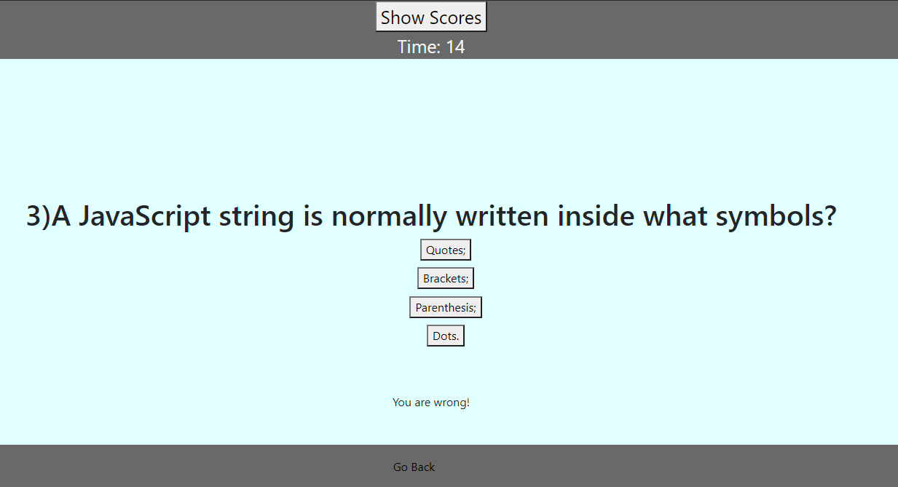
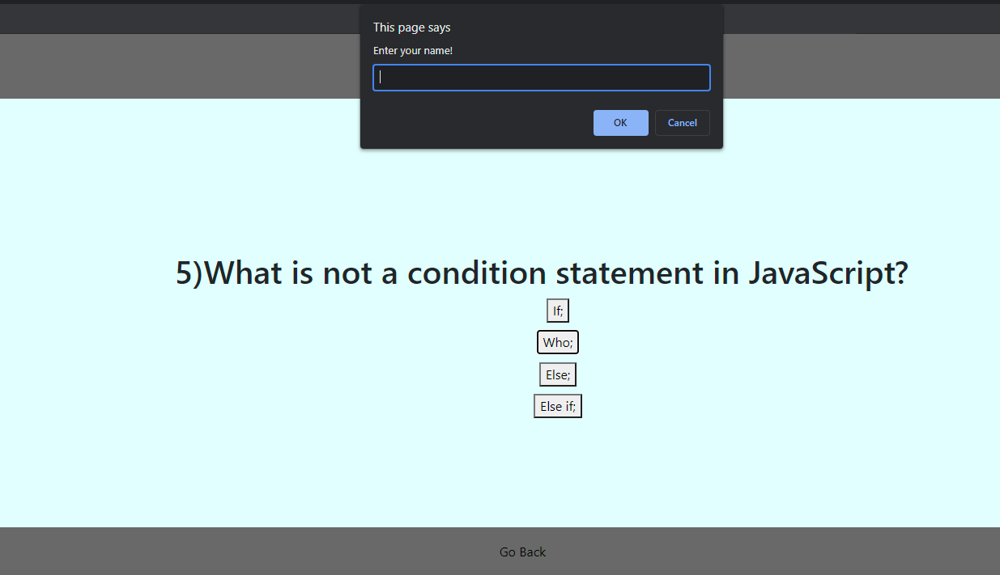
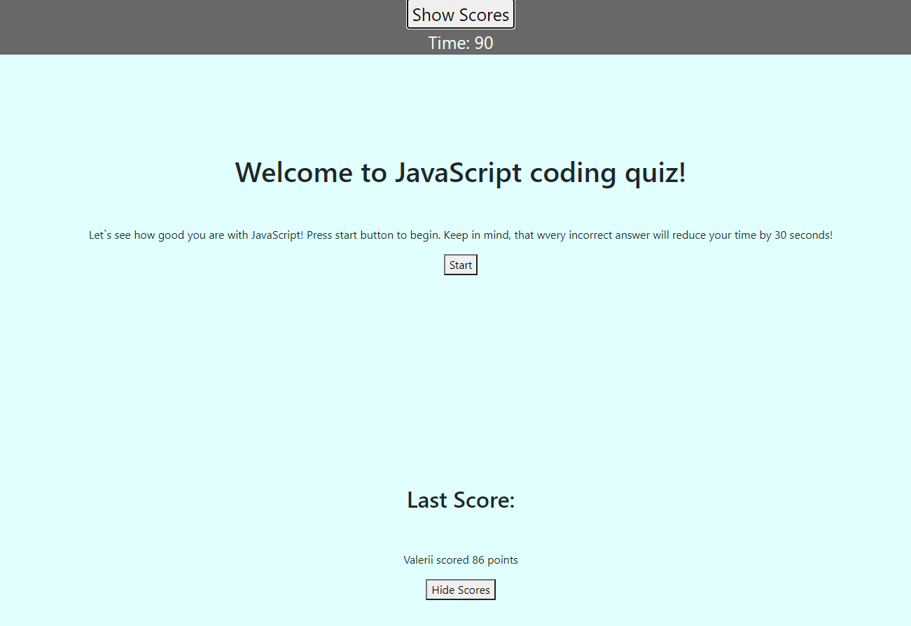

# Password Generator

## Description

This is a Coding Quiz for JavaScript!
This app runs in the browser and features dynamically updated HTML and CSS powered by JavaScript code.

## Table of Contents
- [Installation](#installation)
- [Usage](#usage)
- [Credits](#credits)
- [License](#license)

## Installation
Current project has been saved in my personal GitHub repository and is currently available for cloning and reviews on:

https://github.com/Valllerian/Code-Quiz-Project

## Usage

Main page includes the clickable button to start the game:

 

 

After clicking Start button we are prompted with 5 questions:

 

 

Answering the question with the wrong answer button will decrease the timer by 30 seconds and will give a prompt that 
the answer was wrong. If answer is correct - next question would be displayed and "Correct" prompt would appear.

 

 

After answering all questions or after timer runs out user would be asked for the name to save their score.

 

 

Back on the main page user can click on show score button to show their last score.

 

 

## Credits
Following resources  have been used while working on the project:

1) Storage getItem() Method from w3 schools:

https://www.w3schools.com/jsref/met_storage_getitem.asp;

2) Storing objects explanations:

https://stackoverflow.com/questions/2010892/storing-objects-in-html5-localstorage;

3) List of licenses:

 https://choosealicense.com/;

4) Clearing the local storage explanation:

https://stackoverflow.com/questions/7667958/clearing-localstorage-in-javascript

## License
Current project is unlicensed. Which means - "Anyone is free to copy, modify, publish, use, compile, sell, or
distribute this software, either in source code form or as a compiled
binary, for any purpose, commercial or non-commercial, and by any
means." (Quote for source #3)

